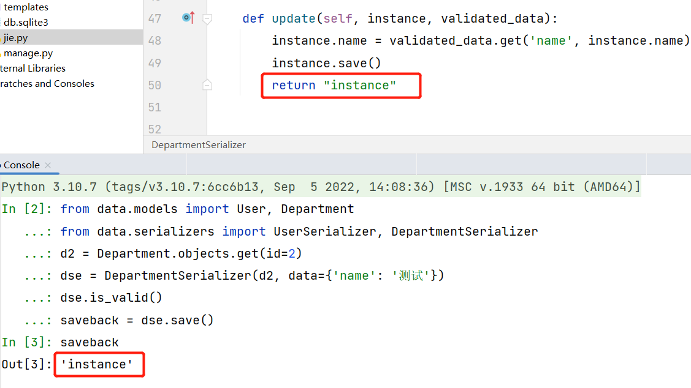

# DRF


##  创建Serializer对象

除了instance和data参数外，在构造Serializer对象时，还可通过**context**参数额外添加数据，如

```
DepartmentSerializer(data={'name': '运营'},context={"add":"end"})
```

`DepartmentSerializer`序列化器内部使用`context`:

```python
    def validate_name(self, attrs):
        if '部' not in attrs:
            return attrs + "部" + self.context.get('add')
        return attrs
```

使用`self.context`，即可拿到传入的额外参数值


在序列化器定义的`create`和`update`函数的返回最后给到`save()`的返回值

```python
class DepartmentSerializer(serializers.Serializer):
	...
    def update(self, instance, validated_data):
        instance.name = validated_data.get('name', instance.name)
        instance.save()
        return "instance"
```



