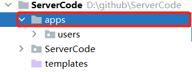
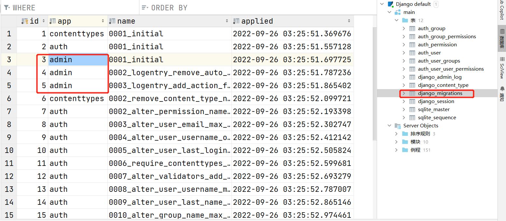
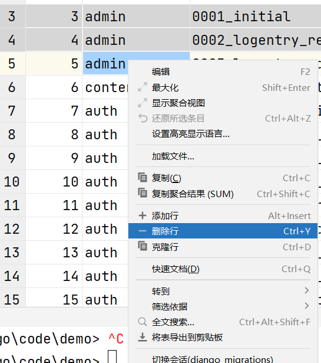
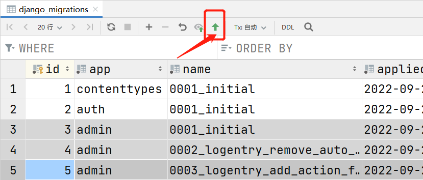
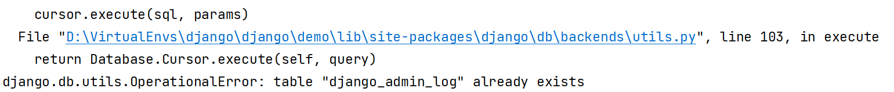
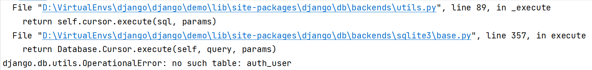
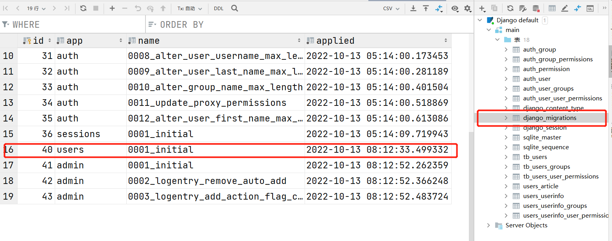
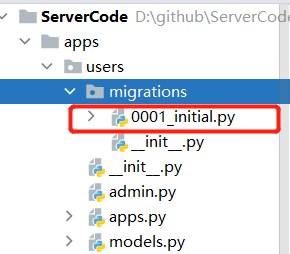
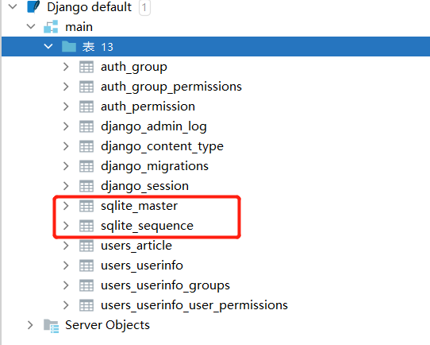
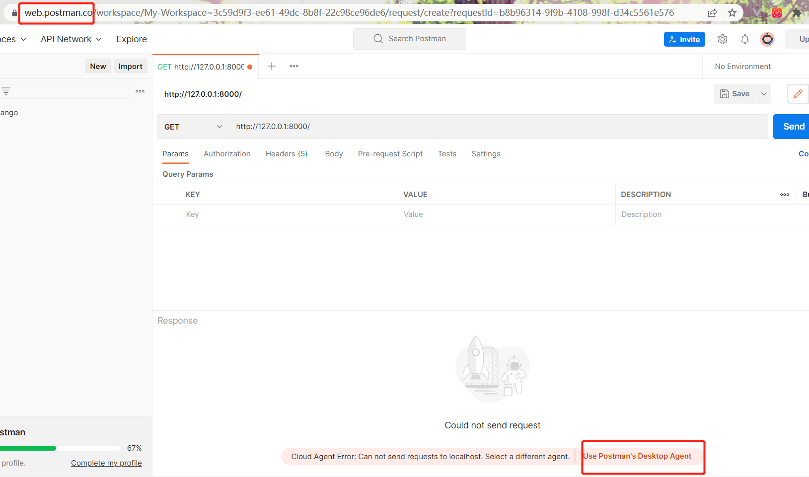

# Django设置

## apps


在项目根目录下创建`apps`目录，把`app`都放在`apps`文件夹下



```shell
# 新建apps目录
cd apps
python ../manage.py startapp users
```


将`apps`目录添加进系统路径中

`settings.py`

```python
import sys
import os

# Build paths inside the project like this: BASE_DIR / 'subdir'.
BASE_DIR = Path(__file__).resolve().parent.parent

# 添加导包路径
sys.path.insert(0, os.path.join(BASE_DIR, 'apps'))

INSTALLED_APPS = [
    "django.contrib.admin",
    "django.contrib.auth",
    "django.contrib.contenttypes",
    "django.contrib.sessions",
    "django.contrib.messages",
    "django.contrib.staticfiles",

    # apps for this project
    "users.apps.UsersConfig",
]
```

由于`apps`已进入系统目录，故`"users.apps.UsersConfig"`，无需写前面的`apps`文件夹名


## migrations

### 报错

出现了 如下报错

> django.db.migrations.exceptions.InconsistentMigrationHistory: Migration **admin**.0001_initial is applied before its dependency users.0001
> _initial on database 'default'.

* 根据报错的信息，删除数据库中，该表的数据。




* 鼠标右键点击删除




* 提交，保存修改到数据库中




* 重新进行迁移，但是依然失败了

* 根据报错信息，将表 `django_admin_log`删除

* 继续报错，继续删表

  

* 把数据库中的很多表删除后，重新迁移


若还遇到其他迁移失败的报错，可以尝试如下操作：

1. 删除数据库记录该model的记录



2. 删除记录迁移的文件，接着重新迁移；




### 密码正确登录不上

[修改管理员密码](https://blog.csdn.net/weixin_49861340/article/details/123409143)后，发现还是登录不上，我是按如下方式处理的

* 删除了数据库的所有表，除了sqlite_开头的两个表




* 清理记录迁移的文件

  


## 跨域

前后端在不同的域名下，需要解决跨域问题


## Simple JWT

`djangorestframework-jwt`库，在17年已不再维护，推荐使用

* 成功实现，参考的是这篇[博客](https://blog.csdn.net/qq_52385631/article/details/126840331)，这篇博客中给出的参考链接也有价值

* [simple jwt实现登录注册](https://blog.csdn.net/roy8666/article/details/124948426) 但是博主没有公开他的 `tools.py`的代码，可参考他的思路
* [simple-jwt](https://blog.csdn.net/weixin_43880991/article/details/121347569) 
* [抽象用户](https://blog.csdn.net/qq_42586468/article/details/112524452)


### CORS

提交token时，被Django的CORS给拦截了

`pip install django-cors-headers`

[Django项目关于跨域cors及解决方案（配置项）](https://blog.csdn.net/li944254211/article/details/109510278)


### Postman

[这篇文章](https://blog.csdn.net/yueguangMaNong/article/details/116797640) 关于 postman给 jwt 传递参数写的比较细

> 我发现使用 postman，不会涉及到CORS，以及跨域访问的问题；即使没有在Django 的 setting.py中进行任何的设置，Postman也是可以使用

使用Postman编辑传递的参数，使用网页端的postman失败了




下载了桌面版的Postman传参，成功

```json
{
    "refresh": "xxx",
    "access": "xxx"
}
```

使用access作为token，提交给服务器

