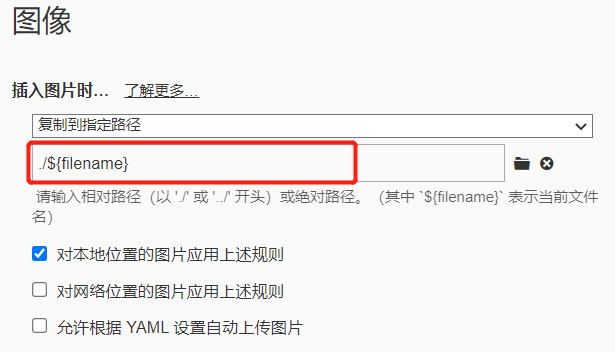

# hexo设置


typora编写的md文档，其中的图片会存放到 `文件同名.asset`文件夹下，编译成网页后，图片未显示出来；解决方案: 参考[blog](https://blog.51cto.com/u_15477117/4919656)


我采取的解决方案

`_config.yml`

```
post_asset_folder: true
```

post_asset_folder 设置为True，在创建md文件时，才会创建同名的存放文件的文件夹



> 若想hexo能读取到图片，图片必须存放在同名的文件夹下:
>
> 
>
> 
>
> 没有 `django设置.assets` 目录，图片存放在 `django设置` 目录下，
>
> 在hexo编译后依然能显示出图片
